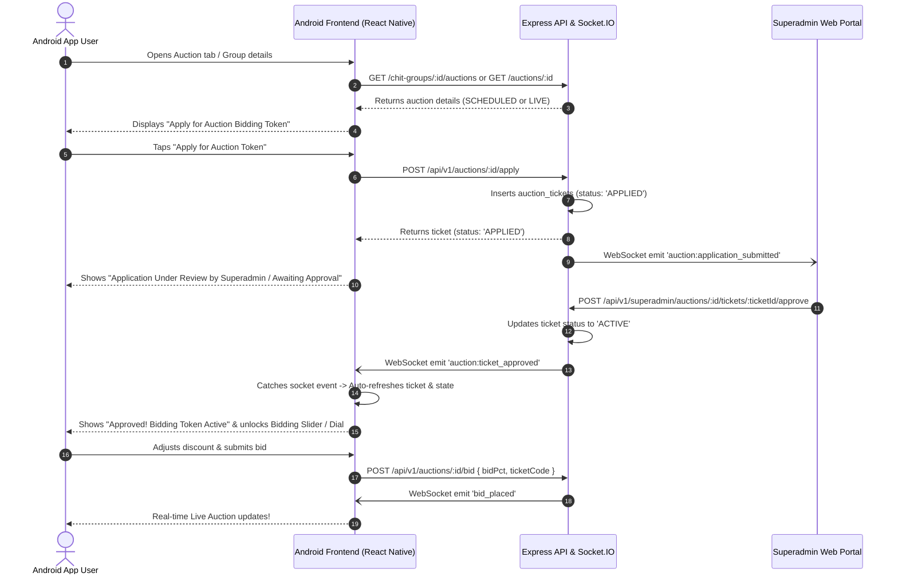

# Implementation Plan: Auction Token Application, Superadmin Approval Workflow & Live Auction Entry

## 1. Context & Problem Statement
Currently in the Android mobile app:
- When a user navigates to the **Auction** tab or views their enrolled chit group, if no live auction is directly detected or if the user is in a group where the monthly auction is scheduled or live, the user cannot easily discover, apply for an **Auction Bidding Token/Ticket**, track approval status, or get redirected automatically into the auction room once approved by the Superadmin.
- If `currentAuction` is null in the store (for example, before an auction is moved to LIVE or when `fetchCurrentAuction` fails to find one because of status matching or timing), `LiveAuctionScreen.jsx` displays a static empty screen: `"No Live Auction in Progress"`.
- When an auction is found, the application button was only inside the `dialCard` on the live screen, which is blocked when there is no active auction found or when the user is viewing the Chit details.
- Once a user submits a ticket application (`POST /api/v1/auctions/:id/apply`), the status transitions to `APPLIED` / `PENDING`. When the Superadmin approves the ticket (`POST /api/v1/superadmin/auctions/:id/tickets/:ticketId/approve`), the backend broadcasts WebSocket events (`auction:ticket_approved`).
- However, the mobile app needs a seamless end-to-end user experience:
  1. **Visibility**: Token apply button / card is clearly visible on the Auction tab, Home screen, and Chit Group Detail screen whenever an auction is SCHEDULED or LIVE for the user's enrolled group.
  2. **Real-time Status Transition**: Once applied, the user sees an interactive banner showing **"Awaiting Superadmin Approval"** with an active status badge and refresh / socket listener.
  3. **Superadmin Action**: The Superadmin receives the dynamic notification/event on the Superadmin Portal (`AuctionsPage.jsx`) to approve/reject the applicant's ticket.
  4. **Dynamic Unlock & Enter**: As soon as the Superadmin clicks **Approve Access**, the mobile app dynamically receives the WebSocket event `auction:ticket_approved`, updates the user's ticket status to `ACTIVE`, unlocks the bidding controls, transitions the UI into the live auction room, and allows the subscriber to immediately submit bids in real-time.

---

## 2. Proposed Architectural & Implementation Flow

---

## 3. Detailed Step-by-Step Changes

### Phase A: Mobile App Store & Data Fetching (`frontend/src/store/useAppStore.ts`)
1. **Enhance Auction Discovery (`fetchCurrentAuction`)**:
   - Ensure `fetchCurrentAuction` checks both user subscriptions and available chit groups for any auction in `LIVE` OR `SCHEDULED` status.
   - Attach the user's existing ticket status to the auction object or state immediately upon fetching.
   - If an auction is `SCHEDULED`, still populate `currentAuction` so the UI can display the upcoming session and token application card instead of a blank "No Auction" screen.

2. **Add Global Socket Listeners for Ticket Approval**:
   - In `initSocketListeners` / `LiveAuctionScreen`:
     - Listen for `auction:ticket_approved` and `auction:ticket_rejected` globally matching `user.id` or `auctionId`.
     - When approved, update `activeTicket` state to `{ ...ticket, status: 'ACTIVE' }` and trigger an alert/toast: `"Your auction bidding token has been approved by the Superadmin! You can now participate in bidding."`.

### Phase B: Android App UI / UX Improvements

1. **Auction Screen (`frontend/src/features/auction/LiveAuctionScreen.jsx`)**:
   - **When No Auction Found or Auction is SCHEDULED**:
     - Do not show a dead-end empty screen.
     - If the user has active subscriptions with scheduled auctions, display a dedicated **"Upcoming Auction & Token Pass"** card with the scheduled date/time and an instant **"Apply for Bidding Token"** button.
   - **Token Application & Approval State Cards**:
     - **Not Applied**: Prominent Gold Accent Card with clear copy: *"Auction Token Required to Participate"* and a primary **"Apply for Auction Token"** button.
     - **Applied / Under Review**: Amber Badge + Pulse icon: *"Application Submitted — Awaiting Superadmin Approval"*. Also provide a manual *"Check Approval Status"* / Refresh button.
     - **Approved (ACTIVE)**: High-contrast Emerald/Gold Verified Token Card displaying `Token Code: [TC-XXXXX]`, *"Authorized to Bid"*, and immediately unlocks the Reverse Bid Dial & Slider.
     - **Rejected**: Clear error badge explaining access was declined.
   - **Auto-Transition & Unlock**:
     - When `activeTicket.status === 'ACTIVE'`, auto-switch the UI view to the live bidding slider and dial.

2. **Chit Detail Screen (`frontend/src/features/chits/ChitDetailScreen.jsx`)**:
   - In the enrolled subscription box, if an upcoming or live auction exists for this group, display:
     - If token not applied: **"Apply for Auction Token"** button.
     - If token pending: **"Token Pending Approval"** tag.
     - If token active: **"Token Active · Enter Auction"** button.

3. **Home Screen (`frontend/src/features/dashboard/HomeScreen.jsx`)**:
   - If an auction is SCHEDULED or LIVE for any of the user's enrolled chits:
     - Render the Auction Banner with the token status (e.g., *"Token Needed"*, *"Pending Approval"*, or *"Token Approved · Enter"*).
     - Direct tap brings user straight into the Auction screen with token actions.

### Phase C: Superadmin Web Approval Verification (`superadmin-web/src/pages/AuctionsPage.jsx`)
- Ensure the Superadmin portal's **"Applicant & Ticket Authorizations"** tab:
  - Dynamically updates via WebSocket when `auction:application_submitted` fires (already wired in `AuctionsPage.jsx`).
  - Has one-click **"Approve Access"** button triggering `approveTicketMutation`.
  - When approved, broadcasts `auction:ticket_approved` containing `userId`, `auctionId`, and `ticketCode`.

---

## 4. Affected Files
| File Path | Component | Changes Planned |
|---|---|---|
| `frontend/src/features/auction/LiveAuctionScreen.jsx` | Mobile App Auction Screen | Make Token Apply card visible on both SCHEDULED and LIVE auctions, add approval waiting state with live socket listening, unlock bidding controls upon approval |
| `frontend/src/features/chits/ChitDetailScreen.jsx` | Mobile App Chit Detail | Show Auction Token status & direct Apply/Enter button for enrolled subscribers |
| `frontend/src/features/dashboard/HomeScreen.jsx` | Mobile App Home Screen | Show live/scheduled auction banner with dynamic token status pill |
| `frontend/src/store/useAppStore.ts` | Mobile State Store | Ensure scheduled auctions populate state properly so token can be applied ahead of time, enhance ticket state tracking |

---

## 5. Verification & Testing Steps
1. **User Application**:
   - Log into Android app as subscriber.
   - Navigate to Chit Group / Auction tab.
   - Verify **"Apply for Auction Token"** button is visible.
   - Tap **Apply** -> Verify status changes to **"Application Under Review by Superadmin"**.
2. **Superadmin Real-time Approval**:
   - Open Superadmin portal on `AuctionsPage`.
   - Verify the subscriber appears under *"Applicant & Ticket Authorizations"* with status `APPLIED`.
   - Click **"Approve Access"**.
3. **Dynamic Unlock on Mobile**:
   - Verify mobile app receives `auction:ticket_approved` without needing a manual full restart.
   - Verify ticket status changes to `ACTIVE` with ticket code.
   - Verify bidding slider and bid dial unlock, allowing subscriber to place bids.
4. **Bid Placement**:
   - Submit a bid and verify it is accepted and logged on both mobile and superadmin live feed.
