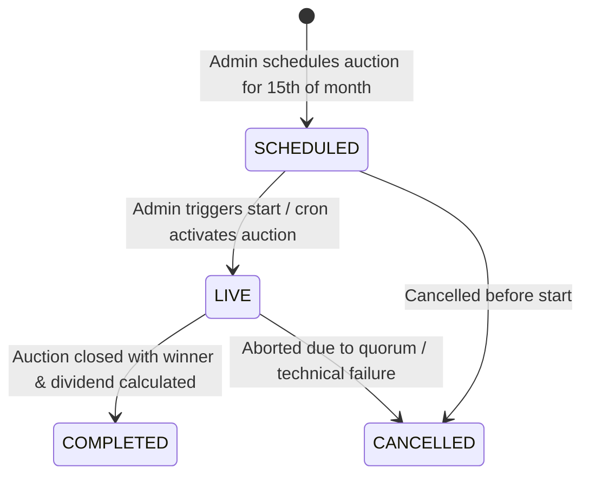
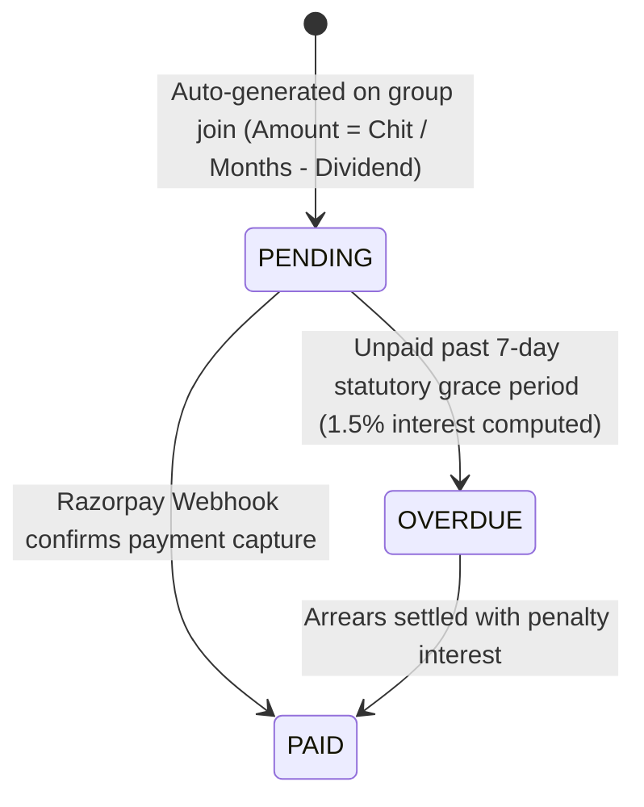
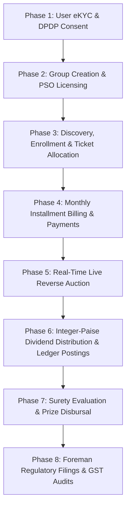
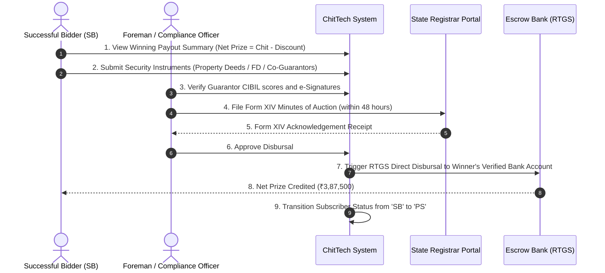
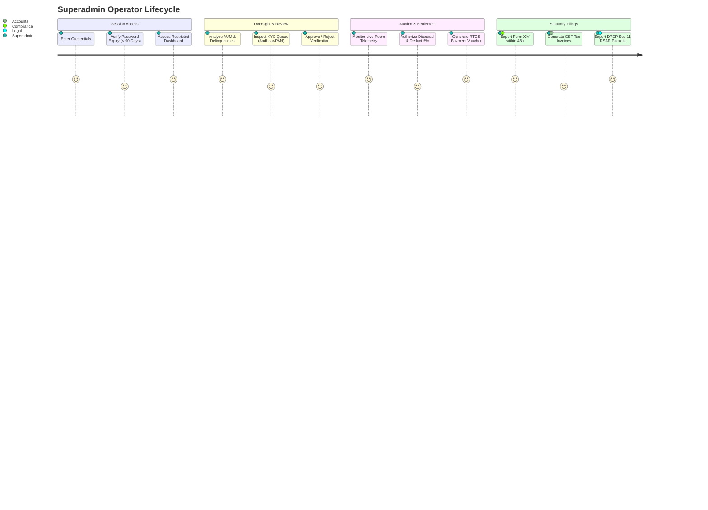

# Naveen Chit Fund — End-to-End Application Architecture & Workflow Guide

## 1. Executive Overview & Core Domain Fundamentals

**Naveen Chit Fund** is an institutional-grade digital management platform for **Rotating Savings and Credit Associations (ROSCAs)**, known in India as **Chit Funds**. It digitizes the complete lifecycle of chit funds under the statutory requirements of the **Chit Funds Act, 1982 (with 2019 Central Amendments)**, the **Digital Personal Data Protection (DPDP) Act, 2023**, and state registrar portals (such as Telangana *T-Chits* and Andhra Pradesh Registrar of Chits).

### 1.1 Core Chit Fund Mechanics
A chit fund is a financial instrument combining credit and savings:
1. **Chit Group Value & Tenure**: A group of $N$ subscribers contributes a fixed monthly sum over $N$ months to create a gross pool (e.g., 20 subscribers $\times$ ₹25,000/month = ₹5,00,000 chit value for 20 months).
2. **Reverse Auction**: Each month, eligible subscribers bid for early capital access by offering a discount (the amount of chit value they are willing to forgo). The subscriber bidding the **highest discount** (i.e. lowest net prize payout) wins the auction.
3. **Foreman Commission**: The chit manager (Foreman) takes a statutory commission (capped at 5% of chit value, e.g., ₹25,000).
4. **Dividend Distribution**: The remaining discount (`Discount - Commission`) is distributed equally as a **dividend** among eligible subscribers, directly reducing their next month's installment payable.
5. **Surety & Disbursal**: The winning subscriber submits statutory sureties/guarantors to secure remaining future installments, after which the net prize money is disbursed via RTGS/NEFT.

### 1.2 Statutory Compliance Framework
- **100% Fixed Deposit Receipt (FDR) Pledge**: Before enrolling members, the Foreman must deposit 100% of the aggregate chit value with a scheduled bank and pledge it with the State Registrar to obtain a **Prior Sanction Order (PSO)** and **Form I / II** approval.
- **Statutory Ceiling on Bids**: Maximum auction discount is capped by law (typically 25% to 40% depending on state rules) to protect members from usurious debt traps.
- **GST Liability**: Under GST Law Notification No. 11/2017, 18% GST is levied **only on the 5% Foreman Commission**, never on subscriber pool contributions.
- **Form XIV Minutes Filing**: Within 48 hours of every auction, signed auction minutes and bid logs must be filed with the State Registrar.

---

## 2. High-Level System Architecture

The platform follows a decoupled, resilient client-server architecture designed for high concurrency during live reverse auctions, strict double-entry ledger bookkeeping, and offline-tolerant client rendering.

```
┌─────────────────────────────────────────────────────────────────────────────┐
│                             CLIENT LAYER                                    │
│                 React Native / Expo (SDK 57) + TypeScript                   │
│      ├── Mobile (Bottom Tab Navigation)                                     │
│      ├── Tablet / Desktop (Navigation Rail & Master-Detail Two-Pane)        │
│      └── Offline-Tolerant Cache & Zustand Global State Store                │
└──────────────────────────────────────┬──────────────────────────────────────┘
                                       │ HTTP / REST & WebSockets (Socket.IO)
                                       ▼
┌─────────────────────────────────────────────────────────────────────────────┐
│                          API GATEWAY & BACKEND                              │
│                      Node.js & Express 4 Application                        │
│   ├── Security: Helmet, CORS, Rate Limiters, Morgan Logging, Compression   │
│   ├── Authentication: JWT Auth Bearer Tokens, Role-Based Guards (RBAC)      │
│   ├── Validation: Zod Type Schemas & Raw Webhook Signature Verification     │
│   ├── Auction Engine: In-Memory / Redis Real-Time Socket Streamer           │
│   └── Dividend Engine: Integer-Paise Precision Bookkeeping Engine           │
└───────────────────┬──────────────────────────────────────┬──────────────────┘
                    │                                      │
                    ▼                                      ▼
┌──────────────────────────────────────┐ ┌────────────────────────────────────┐
│      POSTGRESQL RELATIONAL STORE     │ │         REDIS CACHE / STREAM       │
│  - Multi-tenant ACID Transactions    │ │  - Real-time Current Lowest Bid    │
│  - Concurrency Row Locking (FOR UPD) │ │  - Fast In-Memory Circular Feed    │
│  - Immutable Double-Entry Ledger     │ │  - High-frequency Bid Deduplication│
│  - PGCrypto UUID Primary Keys        │ │  - Transient Sub/Pub Auction State │
└──────────────────────────────────────┘ └────────────────────────────────────┘
                    │                                      │
                    ▼                                      ▼
┌──────────────────────────────────────┐ ┌────────────────────────────────────┐
│       RAZORPAY PAYMENT GATEWAY       │ │      STATE REGISTRAR & DIGILOCKER  │
│  - UPI, Cards, NetBanking, eNACH     │ │  - Aadhaar / DigiLocker XML eKYC   │
│  - Webhook HMAC SHA-256 Signature    │ │  - Form I, II, XIV Regulatory Docs │
└──────────────────────────────────────┘ └────────────────────────────────────┘
```

---

## 3. Actor Roles & State Machines

### 3.1 Platform Actors
1. **Subscriber / Member (`role = 'user'`)**:
   - Discovers certified chit groups.
   - Completes DPDP-compliant Aadhaar & PAN eKYC.
   - Enrolls into groups and receives unique ticket numbers.
   - Services monthly installments via UPI / eNACH.
   - Competes in live reverse auctions via real-time WebSocket bidding.
   - Submits surety documentation upon winning an auction.
2. **Foreman / Chit Administrator (`role = 'admin'`)**:
   - Manages state licensing, FDR bank deposits, and Prior Sanction Orders (PSO).
   - Creates and opens new chit groups.
   - Initiates, monitors, and closes monthly live auctions.
   - Oversees integer-paise dividend calculation and ledger postings.
   - Validates sureties and approves net prize disbursals.
   - Files statutory compliance returns (Form I, II, XIV) and computes GST.

### 3.2 Key Entity State Machines

#### A. Subscriber Group Status (`subscriber_status`)

```mermaid
stateDiagram-v2
    [*] --> NPS : Joins Chit Group (Ticket Assigned)
    NPS --> SB : Submits Winning Bid at Live Auction
    SB --> PS : Sureties Approved & Prize Money Disbursed
    PS --> [*] : Completes all remaining installments till group closes
    
    note right of NPS : Non-Prized Subscriber (Eligible to bid & earn dividends)
    note right of SB : Successful Bidder (Surety vetting in progress)
    note right of PS : Prized Subscriber (Cannot bid again; pays gross installments)
```


#### B. Auction Lifecycle (`chit_auctions.status`)


#### C. Monthly Installment Lifecycle (`installments.status`)


---

## 4. End-to-End Operational Workflows



---

### Workflow 1: User Onboarding & Digital eKYC (DPDP 2023 Compliant)

```
[User Device]               [Backend API]            [SMS Provider / Mock]        [PostgreSQL]
      │                           │                            │                       │
      ├──── 1. POST /otp/request ─▶                            │                       │
      │    (phone number)         ├──── 2. Generate 6-digit ──▶│                       │
      │                           │       code & expiry        │                       │
      │                           ├──── 3. Save OTP in DB ─────────────────────────────▶ (otp_codes)
      │                           ◀──── 4. "OTP sent" response ┼                       │
      │                                                        │                       │
      ├──── 5. POST /otp/verify ──▶                            │                       │
      │    (phone + 6-digit code) ├──── 6. Validate unconsumed & unexpired OTP ────────▶ (otp_codes)
      │                           ├──── 7. Mark OTP consumed ──────────────────────────▶ (consumed=true)
      │                           ├──── 8. Find or create user ────────────────────────▶ (users)
      │                           ├──── 9. Sign JWT Token ─────┤                       │
      │                           │       (userId, role, 7d)   │                       │
      │                           ◀──── 10. Return JWT + user ─┤                       │
      │                                                        │                       │
      ├──── 11. DPDP Consent ────▶ (Store client-side / PATCH /users/me)               │
      │    (5 statutory flags)                                                         │
      │                                                                                │
      ├──── 12. Aadhaar / PAN ───▶ PATCH /api/v1/users/me ─────────────────────────────▶ (kyc_status =
      │    eKYC Submission             (fullName, email, panNumber)                          'PENDING')
      │                                                                                │
      │ [Admin Review] ──────────▶ POST /api/v1/users/:id/kyc ─────────────────────────▶ (kyc_status =
      │                            { decision: 'APPROVED' }                                  'APPROVED')
```

1. **Authentication**: Subscriber enters 10-digit Indian mobile number. Backend generates a cryptographically secure 6-digit OTP stored in `otp_codes` (5-minute TTL, rate-limited to 5 requests / 15 min).
2. **Verification & Session**: Upon verification, backend invalidates the OTP and creates/fetches a record in `users`, issuing an HMAC SHA-256 JWT bearer token stored securely via `expo-secure-store` or browser local storage.
3. **DPDP 2023 Five-Point Consent**: The subscriber grants granular consent across five explicit categories:
   - Identity Verification (UIDAI / DigiLocker).
   - Credit Bureau Check (CIBIL / Experian).
   - Auction Participation Records.
   - Regulatory Reporting (PMLA / FIU-IND).
   - Marketing Communications (optional toggle).
4. **Identity Proofing**: Subscriber enters PAN and Aadhaar tokens with liveness confirmation. If NRI status is selected, co-signatory and NRE/NRO banking verification are captured.
5. **Approval**: Admin reviews pending KYC records via `GET /api/v1/users?kycStatus=PENDING` and approves the record via `POST /api/v1/users/:id/kyc`.

---

### Workflow 2: Chit Group Creation & Regulatory Licensing

```
[Foreman / Admin]                 [Backend API]                         [PostgreSQL DB]
      │                                 │                                      │
      ├─ 1. Pledge 100% FDR at Bank     │                                      │
      ├─ 2. Obtain State Registrar PSO  │                                      │
      │                                 │                                      │
      ├─ 3. POST /api/v1/chit-groups ──▶│                                      │
      │    { name, chitAmount,          │                                      │
      │      durationMonths,            ├─ 4. Validate body schema (Zod)       │
      │      foremanCommissionPct (5%), ├─ 5. Insert new chit group record ───▶ (chit_groups)
      │      registrarStateCode,        │    (status = 'OPEN')                 │
      │      dividendPolicy }           ◀─ 6. Return 201 Created Group         │
```

1. **Prerequisite**: Foreman deposits 100% aggregate chit value as FDR with a scheduled bank and uploads Bye-Laws to obtain the Prior Sanction Order (PSO) number from the State Registrar.
2. **Creation**: Admin calls `POST /api/v1/chit-groups` with:
   - `chitAmount`: Total pool value (e.g. ₹5,00,000).
   - `durationMonths`: Total duration and seats (e.g. 20 months).
   - `foremanCommissionPct`: Statutory fee (default 5.00%).
   - `registrarStateCode`: State PSO registration code (e.g. `Telangana (T-Chits: TG-HYD-8821)`).
   - `dividendDistributionPolicy`: `NON_PRIZED_ONLY` (default Indian ROSCA model) or `ALL_SUBSCRIBERS`.
3. **Status**: Group is persisted with status `OPEN` and exposed to subscribers.

---

### Workflow 3: Chit Discovery, Enrollment & Ticket Allocation

```
[Subscriber App]              [Backend API]                       [PostgreSQL (Transaction)]
      │                             │                                          │
      ├─ 1. GET /chit-groups ──────▶│                                          │
      │    (filters: state, tenure) ├─ 2. Query available groups with slots ──▶ (chit_groups)
      │    ◀────────────────────────┤                                          │
      │                             │                                          │
      ├─ 3. POST /chit-groups/ ────▶│                                          │
      │    :groupId/join            ├─ 4. BEGIN TRANSACTION                    │
      │    (with JWT Bearer)        ├─ 5. SELECT * FROM chit_groups FOR UPDATE │
      │                             │    (Locks row to prevent race cond.)     │
      │                             ├─ 6. Check if already joined              │
      │                             ├─ 7. Next Ticket = COALESCE(MAX, 0) + 1   │
      │                             ├─ 8. INSERT INTO subscriptions ──────────▶ (subscriptions: ticket_number,
      │                             │                                           status = 'NPS')
      │                             ├─ 9. Generate N Monthly Installments ────▶ (installments: month 1..N,
      │                             │    (amount_due = chit / months,           status = 'PENDING')
      │                             │     status = 'PENDING')                  │
      │                             ├─ 10. COMMIT TRANSACTION                  │
      │                             ◀─ 11. Return 201 Joined Subscription ─────┘
```

1. **Discovery**: Subscriber filters available chits using search, tenure, state jurisdiction, and vacant slots.
2. **Atomic Joining**: Subscriber invokes `POST /api/v1/chit-groups/:groupId/join`.
3. **Row-Level Concurrency Guard**: Backend initiates a database transaction with `FOR UPDATE` on the `chit_groups` row, guaranteeing no two concurrent requests can grab the same ticket.
4. **Ticket Assignment**: Allocates `ticket_number = COALESCE(MAX(ticket_number), 0) + 1` with initial status `NPS`.
5. **Installment Schedule Initialization**: Automatically generates all $N$ monthly records in the `installments` table with `status = 'PENDING'`.

---

### Workflow 4: Monthly Installment Servicing & Payment Processing

```
[Subscriber App]         [Razorpay Gateway]           [Backend API]            [PostgreSQL (Ledger)]
      │                         │                           │                           │
      ├─ 1. Click "Pay Due" ───────────────────────────────▶│                           │
      │    (POST /payments/order)                           ├─ 2. Validate installment  │
      │                         ◀─ 3. Create Order ─────────┤    amount & owner         │
      │                         │    (amount, INR, receipt) │                           │
      │                         ├──────────────────────────▶│                           │
      │                         │                           ├─ 4. INSERT INTO payments ─▶ (payments:
      │    ◀────────────────────┴── 5. Return Order ID ─────┤    status = 'CREATED')      status='CREATED')
      │                                                     │                           │
      ├─ 6. Open Checkout Modal │                           │                           │
      │    (UPI / Card / NetBank)                          │                           │
      ├─ 7. User Authorizes ───▶│                           │                           │
      │                         │                           │                           │
      │                         ├─ 8. Webhook: payment.captured (Raw JSON)              │
      │                         │    Header: x-razorpay-signature                       │
      │                         │                           │                           │
      │                         └──────────────────────────▶├─ 9. Verify HMAC-SHA256    │
      │                                                     │    signature with secret  │
      │                                                     ├─ 10. UPDATE payments ─────▶ (status='SUCCESS',
      │                                                     │                             payment_id=...)
      │                                                     ├─ 11. UPDATE installments ─▶ (status='PAID')
      │                                                     ├─ 12. INSERT ledger_entries (entry_type=
      │                                                     │    (Double-entry credit)   'INSTALLMENT')
      │                                                     ◀─ 13. Res 200 {success:true}
```

1. **Installment Calculation**: Installment payable equals base monthly installment minus the subscriber's allocated dividend from the preceding month's auction.
2. **Order Creation**: Subscriber calls `POST /api/v1/payments/order` with `installmentId`. The backend creates a Razorpay payment order and logs an internal `payments` row in `CREATED` status.
3. **Payment Execution**: Subscriber completes payment via UPI intent, Net Banking, or recurring eNACH mandate.
4. **Signature Verification Webhook**: Razorpay posts a `payment.captured` event to `POST /api/v1/payments/webhook`. Express processes the payload using raw buffer (`express.raw({ type: 'application/json' })`) and validates the HMAC SHA-256 signature against `RAZORPAY_WEBHOOK_SECRET`.
5. **Ledger Booking**: Upon verification, the payment is marked `SUCCESS`, the installment is marked `PAID`, and a double-entry bookkeeping entry is written to `ledger_entries` with `entry_type = 'INSTALLMENT'`.
6. **Grace Period & Defaults**: Under § 22 of the Chit Funds Act, subscribers have a 7-day grace period from the due date before penalty interest (1.5% per month) is accrued.

---

### Workflow 5: Real-Time Live Reverse Auction Engine

```
[Subscribers in Room]          [Socket.IO Gateway]           [Backend API]            [Redis Cache]
      │                                │                           │                        │
      │                                │◀── 1. Admin starts auction (POST /auctions/:id/start)
      │                                │    (Status -> LIVE)       ├─ 2. Initialize Key ───▶ SET auction:{id}
      │                                │                           │    {lowestBidPct: null}
      │                                │◀── 3. emit("auction:started")                      │
      │                                │                           │                        │
      ├─ 4. joinAuction({auctionId}) ─▶│                           │                        │
      │    (Subscribes to room)        │                           │                        │
      │                                │                           │                        │
      ├─ 5. Submit Reverse Bid ───────────────────────────────────▶│                        │
      │    (POST /auctions/:id/bid)                                ├─ 6. Rate Limit Check   │
      │    { bidPct: 22.5% }                                       │    (Max 5 bids/10s)    │
      │                                                            ├─ 7. Verify Eligibility │
      │                                                            │    (Must be active NPS)│
      │                                                            ├─ 8. GET current lowest ┼─▶ (Redis)
      │                                                            │    (New bid must be    │
      │                                                            │     strictly lower)    │
      │                                                            ├─ 9. Update lowest bid ─▶ SET auction:{id}
      │                                                            ├─ 10. Push to Feed ────▶ LPUSH auction:{id}:bids
      │                                                            ├─ 11. INSERT audit log ─▶ (PostgreSQL DB:
      │                                                            │                         auction_bids)
      │                                ◀── 12. broadcastBid() ─────┤                        │
      │◀─ 13. emit("auction:bid") ─────┤   (auctionId, bidData)    │                        │
      │   (Live dial updates instantly)│                           ◀─ 14. 200 OK Response ──┘
```

1. **Reverse Auction Principle**: The auction is a **reverse auction**. Subscribers compete for early lump-sum capital by offering a discount percentage (bid discount % from 0% up to statutory cap, e.g. 25-40%).
2. **Bid Placement**: When Subscriber A bids 22.5%, they are offering to forgo 22.5% of the chit value. To outbid them, Subscriber B must offer a higher discount (e.g. 23.0%), meaning the net prize is lower. The system validates `bidPct > currentLowestBidPct`.
3. **Dual Tier Speed & Audit**:
   - **Low-latency Path**: The bid is validated and written to Redis (`auction:<id>` and `auction:<id>:bids`), then broadcast via WebSocket room `auction:<auctionId>` to all active clients within milliseconds.
   - **Audit Trail Path**: The bid is persisted immediately to PostgreSQL `auction_bids` table with timestamp and client IP address for regulatory inspection.
4. **Client Experience**: The frontend displays a synchronized circular SVG `BidDial` with countdown timer, remaining seconds, current lowest bid, and reactive quick-increment buttons.

---

### Workflow 6: Auction Close & Integer-Paise Dividend Distribution

```
[Foreman / Admin]                 [Backend API]                    [PostgreSQL DB (Transaction)]
      │                                 │                                      │
      ├─ 1. POST /auctions/:id/close ──▶│                                      │
      │                                 ├─ 2. Fetch lowest bid from Redis      │
      │                                 ├─ 3. BEGIN TRANSACTION ───────────────┤
      │                                 ├─ 4. UPDATE chit_auctions ───────────▶ (status = 'COMPLETED',
      │                                 │    (winning_bid_pct, winner_id)        closed_at = now())
      │                                 ├─ 5. UPDATE subscriptions ───────────▶ (subscriber_status = 'PS',
      │                                 │    (Mark winner as Prized Sub)         prized_month = month)
      │                                 ├─ 6. Pull active subscriptions ──────▶ (For dividend calculation)
      │                                 │                                      │
      │                                 ├─ 7. Execute calculateDividend()      │
      │                                 │    ├── Convert to integer paise      │
      │                                 │    ├── Calc bid discount & commission│
      │                                 │    ├── Divide by eligible subscribers│
      │                                 │    └── Add remainder paise to last   │
      │                                 │                                      │
      │                                 ├─ 8. INSERT Commission Ledger ───────▶ (ledger_entries: 'COMMISSION')
      │                                 ├─ 9. INSERT Prize Payout Ledger ─────▶ (ledger_entries: 'PRIZE_PAYOUT')
      │                                 ├─ 10. INSERT N Dividend Ledgers ─────▶ (ledger_entries: 'DIVIDEND' × N)
      │                                 ├─ 11. COMMIT TRANSACTION ─────────────┤
      │                                 │                                      │
      │                                 ├─ 12. broadcastClose(io, auctionId) ─▶ Emits "auction:closed"
      │                                 ◀─ 13. Return 200 OK + Breakdown ──────┤
```

#### Deterministic Integer-Paise Math
To prevent floating-point drift and ensure zero money is created or lost, all monetary calculations execute in integer paise:
$$\text{chitAmountPaise} = \text{round}(\text{chitAmount} \times 100)$$
$$\text{bidDiscountPaise} = \text{round}\left(\frac{\text{chitAmountPaise} \times \text{winningBidPct}}{100}\right)$$
$$\text{commissionPaise} = \text{round}\left(\frac{\text{chitAmountPaise} \times \text{foremanCommissionPct}}{100}\right)$$
$$\text{distributablePaise} = \text{bidDiscountPaise} - \text{commissionPaise}$$

The distributable pool is divided among $N$ eligible subscribers (sorted deterministically by `ticket_number`):
$$\text{baseSharePaise} = \left\lfloor \frac{\text{distributablePaise}}{N} \right\rfloor, \quad \text{remainderPaise} = \text{distributablePaise} \pmod N$$
The last subscriber absorbs $\text{remainderPaise}$, guaranteeing:
$$\sum_{i=1}^N \text{amountPaise}_i \equiv \text{distributablePaise}$$

---

### Workflow 7: Surety Evaluation & Prize Disbursal



1. **Winning Disbursal Calculation**: Net payout to the winning subscriber equals the gross chit value minus their winning bid discount (e.g. ₹5,00,000 chit less 22.5% discount = ₹3,87,500).
2. **Surety Documentation**: To protect the non-prized subscribers from future default, the winner must provide statutory security:
   - Personal surety from 2 salaried or business co-guarantors.
   - Or pledge of Fixed Deposit, National Savings Certificate (NSC), or immovable property.
3. **Form XIV Statutory Minutes**: Under § 18 of the Chit Funds Act, the Foreman must submit minutes of the auction signed by the Foreman and participating subscribers to the Registrar within 48 hours.
4. **RTGS Disbursal**: Following Foreman and registrar approval, funds are wired directly to the winner's bank account. Status is updated from `SB` to `PS`.

---

### Workflow 8: Foreman Regulatory, Tax & Financial Reporting

1. **Registrar Document Lifecycle**:
   - **Form I**: Prior Sanction Application prior to commencing any chit series.
   - **Form II**: Bye-Laws and Chit Agreement registration.
   - **Form XIV**: Monthly filing of auction proceedings within 48 hours.
2. **Statutory GST Computation**:
   - Under GST Notification 11/2017 (Heading 9971), chit fund pool contributions are financial transactions outside GST.
   - GST of 18% is applicable **strictly on the 5% Foreman Commission**.
   - Example: On a ₹5,00,000 chit with a 5% commission (₹25,000), monthly GST liability is $\text{₹}25,000 \times 18\% = \text{₹}4,500$ (CGST 9% + SGST 9%).
3. **Double-Entry Ledger Audit**: The Foreman can query `GET /api/v1/admin/ledger` filterable by `groupId`, `subscriptionId`, and date ranges to generate certified financial statements for statutory auditors and state inspectors.

---

## 5. Database Schema & Entity Relationship Model

```
                    ┌─────────────────────────┐
                    │          users          │
                    ├─────────────────────────┤
                    │ id (UUID, PK)           │
                    │ full_name (TEXT)        │
                    │ phone (TEXT, UNIQUE)    │
                    │ email (TEXT)            │
                    │ role (user | admin)     │
                    │ kyc_status (TEXT)       │
                    │ pan_number (TEXT)       │
                    └────────────┬────────────┘
                                 │ 1:N
                                 ▼
┌─────────────────────────┐ 1:N ┌─────────────────────────┐
│       chit_groups       │────▶│      subscriptions      │
├─────────────────────────┤     ├─────────────────────────┤
│ id (UUID, PK)           │     │ id (UUID, PK)           │
│ name (TEXT)             │     │ chit_group_id (UUID, FK)│
│ chit_amount (NUMERIC)   │     │ user_id (UUID, FK)      │
│ duration_months (INT)   │     │ ticket_number (INT)     │
│ foreman_comm_pct (NUM)  │     │ subscriber_status (TEXT)│
│ status (TEXT)           │     │ prized_month (INT)      │
└────────────┬────────────┘     └────────────┬────────────┘
             │ 1:N                           │ 1:N
             ▼                               ▼
┌─────────────────────────┐     ┌─────────────────────────┐
│      chit_auctions      │     │      installments       │
├─────────────────────────┤     ├─────────────────────────┤
│ id (UUID, PK)           │     │ id (UUID, PK)           │
│ chit_group_id (UUID, FK)│     │ subscription_id (UUID)  │
│ month_number (INT)      │     │ month_number (INT)      │
│ status (TEXT)           │     │ amount_due (NUMERIC)    │
│ winning_bid_pct (NUM)   │     │ status (PENDING/PAID)   │
│ winning_sub_id (UUID)   │     │ due_date (DATE)         │
└────────────┬────────────┘     └─────────────────────────┘
             │ 1:N                           ▲
             ▼                               │ 1:N
┌─────────────────────────┐     ┌────────────┴────────────┐
│      auction_bids       │     │        payments         │
├─────────────────────────┤     ├─────────────────────────┤
│ id (UUID, PK)           │     │ id (UUID, PK)           │
│ auction_id (UUID, FK)   │     │ user_id (UUID, FK)      │
│ subscription_id (UUID)  │     │ subscription_id (UUID)  │
│ bid_pct (NUMERIC)       │     │ installment_id (UUID)   │
│ bid_at (TIMESTAMPTZ)    │     │ razorpay_order_id (TEXT)│
│ ip_address (TEXT)       │     │ razorpay_pay_id (TEXT)  │
└─────────────────────────┘     │ status (CREATED/SUCCESS)│
                                └─────────────────────────┘
                                             │
                                             ▼
                                ┌─────────────────────────┐
                                │     ledger_entries      │
                                ├─────────────────────────┤
                                │ id (UUID, PK)           │
                                │ chit_group_id (UUID)    │
                                │ subscription_id (UUID)  │
                                │ entry_type (ENUM)       │
                                │ amount (NUMERIC)        │
                                │ auction_id (UUID)       │
                                └─────────────────────────┘
```

---

## 6. Complete API & Protocol Reference

### 6.1 REST Endpoints

| Category | Method | Endpoint | Auth Level | Description |
|---|---|---|---|---|
| **Auth** | `POST` | `/api/v1/auth/otp/request` | Public | Requests a 6-digit SMS OTP (Rate limited: 5 req/15 min) |
| | `POST` | `/api/v1/auth/otp/verify` | Public | Verifies OTP, registers or fetches user, returns JWT token |
| **Users** | `GET` | `/api/v1/users/me` | Authenticated | Retrieves current user profile & KYC status |
| | `PATCH` | `/api/v1/users/me` | Authenticated | Updates PAN, email, triggers KYC status to `PENDING` |
| | `GET` | `/api/v1/users?kycStatus=` | Admin Only | Lists users for KYC verification review |
| | `POST` | `/api/v1/users/:id/kyc` | Admin Only | Approves or rejects subscriber KYC |
| **Chit Groups** | `GET` | `/api/v1/chit-groups` | Public | Lists available groups (status filter, pagination) |
| | `GET` | `/api/v1/chit-groups/:id` | Public | Fetches group details and full list of ticket statuses |
| | `POST` | `/api/v1/chit-groups` | Admin Only | Creates a new registered chit group in `OPEN` status |
| | `POST` | `/api/v1/chit-groups/:id/close` | Admin Only | Transitions group status to `CLOSED` |
| **Subscriptions** | `POST` | `/api/v1/chit-groups/:id/join` | Authenticated | Atomically joins group, assigns next ticket, creates installments |
| | `GET` | `/api/v1/subscriptions/mine` | Authenticated | Fetches authenticated user's active chit subscriptions |
| | `GET` | `/api/v1/subscriptions/:id/installments` | Owner/Admin | Returns monthly installment payment schedule |
| | `GET` | `/api/v1/subscriptions/:id/dividends` | Owner/Admin | Returns historical ledger of dividends and prize payouts |
| **Auctions** | `POST` | `/api/v1/chit-groups/:id/auctions` | Admin Only | Schedules an upcoming monthly reverse auction |
| | `GET` | `/api/v1/chit-groups/:id/auctions` | Public | Paginated list of monthly auctions for a group |
| | `GET` | `/api/v1/auctions/:id` | Public | Fetches auction details and live Redis state if active |
| | `POST` | `/api/v1/auctions/:id/start` | Admin Only | Moves auction to `LIVE`, initializes Redis state |
| | `POST` | `/api/v1/auctions/:id/bid` | Authenticated | Places reverse bid (Rate limited: 5 bids/10s per IP) |
| | `POST` | `/api/v1/auctions/:id/close` | Admin Only | Finalizes winner, updates status to `COMPLETED`, runs dividend engine |
| **Payments** | `POST` | `/api/v1/payments/order` | Authenticated | Creates a Razorpay payment order for an installment |
| | `POST` | `/api/v1/payments/webhook` | Raw Signature | Handles server-to-server captured payment webhooks |
| | `GET` | `/api/v1/payments/mine` | Authenticated | Lists subscriber payment receipts and transaction records |
| **Admin** | `GET` | `/api/v1/admin/dashboard` | Admin Only | Fetches aggregate metrics (active chits, AUM, pending KYC) |
| | `GET` | `/api/v1/admin/ledger` | Admin Only | Paginated double-entry ledger entries with audit filters |
| | `GET` | `/api/v1/admin/subscribers` | Admin Only | Search subscribers across groups by name or phone |

### 6.2 WebSocket (Socket.IO) Events

| Event Name | Direction | Payload Structure | Description |
|---|---|---|---|
| `joinAuction` | Client $\rightarrow$ Server | `{ auctionId: string }` | Joins room `auction:<auctionId>` |
| `leaveAuction` | Client $\rightarrow$ Server | `{ auctionId: string }` | Leaves room `auction:<auctionId>` |
| `auction:bid` | Server $\rightarrow$ Client | `{ bidPct, subscriptionId, ticketNumber, bidAt }` | Real-time broadcast of new lowest bid |
| `auction:closed`| Server $\rightarrow$ Client | `{ winningBidPct, winningSubscriptionId, winningTicketNumber }` | Broadcast when auction is closed |

---

## 7. Fault Tolerance, Edge Cases & Concurrency Handling

1. **Race Conditions on Joining Chit Groups**:
   - Two users attempting to take the last ticket slot concurrently are serialized via PostgreSQL row-level locking:
     ```sql
     SELECT * FROM chit_groups WHERE id = $1 FOR UPDATE;
     ```
   - If `vacant_slots === 0`, the transaction rejects the second caller with HTTP 400.
2. **Reverse Auction Double-Bidding & Out-of-Order Packets**:
   - The bid validation checks the in-memory / Redis cache before persisting.
   - If Bidder A submits 23.0% and Bidder B submits 22.8% a millisecond later, Bidder B is rejected with:
     `Bid must be lower than current lowest bid (23%)`.
3. **Webhook Duplicate Delivery & Idempotency**:
   - Razorpay may send duplicate `payment.captured` webhooks.
   - The backend looks up `payments` by `razorpay_order_id`. If the record is already in `SUCCESS` status, it returns `200 OK` without re-crediting the ledger or altering installment states.
4. **Rounding Precision & Integer Paise**:
   - No floating-point numbers are stored or computed for ledger balances. All internal computations use paise ($1 \text{ INR} = 100 \text{ paise}$).
   - Any remainder from division is assigned to the final ticket holder, guaranteeing zero rounding leakage.
5. **Offline & Low Connectivity Support**:
   - The React Native mobile frontend detects connection drops via `NetInfo` / WebSocket status hooks.
   - When disconnected, the `OfflineBanner` is rendered, displaying cached local state from Zustand and preventing bid submissions until reconnect.

---

## 8. Superadmin Portal: Institutional Governance & Statutory Workflow

The Superadmin Portal (`/superadmin-web`) is a high-security, web-based management console engineered for executive officers, compliance attorneys, and head-office auditors. It operates as an institutional oversight layer decoupled from the day-to-day mobile apps.

```
+---------------------------------------------------------------------------------------------------------+
|                                    SUPERADMIN GOVERNANCE PORTAL                                         |
|                                (React 18 + Tailwind + TanStack Query)                                   |
+---------------------------------------------------------------------------------------------------------+
       |                        |                         |                           |
       v                        v                         v                           v
+---------------+      +------------------+      +-------------------+      +-------------------+
| Auth & RBAC   |      | Executive Desk   |      | Operations Desk   |      | Compliance Engine |
|---------------|      |------------------|      |-------------------|      |-------------------|
| • Admin JWT   |      | • Macro AUM      |      | • Foreman Mgmt    |      | • Form XIV Tracker|
| • 90d Rotate  |      | • Realized Comm. |      | • Chit Group Ops  |      | • GST Notif 11/17 |
| • Rate-limit  |      | • Default Risk   |      | • KYC Approvals   |      | • DPDP Sec 11 DSAR|
| • Audit Log   |      | • Liquidity Run  |      | • RTGS Disbursal  |      | • Audit Stream    |
+---------------+      +------------------+      +-------------------+      +-------------------+
       |                        |                         |                           |
+---------------------------------------------------------------------------------------------------------+
|                                 ISOLATED API GATEWAY (/api/v1/superadmin/*)                             |
|                           (Zod Schemas + Audited PostgreSQL Transactions)                              |
+---------------------------------------------------------------------------------------------------------+
```

---

### 8.1 Architectural Isolation & Security Model

1. **Schema & Credential Isolation**:
   - Superadmin accounts are maintained in a dedicated security context. Admin JWT tokens are minted with `role: "SUPERADMIN"` and aud-scoped to institutional web origins.
   - Mobile subscriber and foreman endpoints reject tokens lacking the superadmin scope with `HTTP 403 Forbidden`.
2. **Aggressive Rate Limiting**:
   - Superadmin endpoints employ strict window limits (e.g., 60 requests/minute per IP) via Express rate limiters to mitigate credential stuffing and automated scraping of citizen KYC data.
3. **Immutable Audit Event Journaling**:
   - Every mutation executed via the Superadmin Portal (KYC status transitions, auction force-closes, ticket reassignments, RTGS payouts) automatically writes an entry to `audit_events` with:
     - `actor_id` (Superadmin UUID)
     - `action_type` (e.g., `SURETY_REJECTED`, `AUCTION_FORCE_CLOSED`, `DISP_EXPORTED`)
     - `ip_address` & `user_agent`
     - `diff_snapshot` (Previous vs. New values in JSONB format).

---

### 8.2 Operator Personas & Daily Journeys



---

### 8.3 Executive Dashboard & Real-Time Macro KPIs

The executive control deck serves real-time macroeconomic indicators across all active chit groups:
- **Total Assets Under Management (AUM)**: Sum of gross chit values of all active and uncommenced groups ($\sum \text{Chit Value}$).
- **Realized Foreman Commission**: Cumulative 5% gross commission earned across completed auctions.
- **Default & Delinquency Exposure**: Total overdue installments across all subscribers flagged as `LATE` (> 7 days post-due).
- **System Health & Auction Pulse**: Real-time counter of live auctions, vacant subscription seats, and pending KYC requests.

---

### 8.4 Foreman Management & Branch Oversight

Superadmins maintain direct supervision over registered foremen:
1. **Onboarding**: Create foreman profiles with corporate branch affiliation, email, and mobile contact.
2. **Quota Allocation**: Cap the maximum number of active chit groups a foreman may administer.
3. **Suspension Protocol**: Revoke foreman credentials instantly. Suspended foremen are disconnected from active WebSocket auction rooms and prohibited from publishing new groups.

---

### 8.5 Chit Group & Subscriber Ticket Administration

1. **PSO Filing & Activation**:
   - Ensure Prior Sanction Order (PSO) numbers and state registration references are recorded before a group transitions to `ACTIVE`.
2. **Roster Audits**:
   - Inspect subscriber allocations per chit group.
   - Detect vacant slots and track payment collection progress.
3. **Ticket Substitution & Default Transfers**:
   - Under Section 28 of the Chit Funds Act, if a non-prized subscriber defaults on consecutive installments, the Superadmin or Foreman can substitute the ticket to an approved waitlisted subscriber upon issuing statutory notice.

---

### 8.6 Member KYC & Verification Queue

The KYC queue processes submitted subscriber identity artifacts:
1. **Document Inspection**:
   - Verification officers view uploaded front/back images of Aadhaar cards and PAN cards.
2. **Cross-Match & Approval**:
   - Confirm names match legal records.
   - Upon clicking **Approve**, the subscriber's `kyc_status` updates to `VERIFIED`, enabling them to place bids in upcoming auctions.
3. **Rejection & Audit Trails**:
   - Rejections require selecting a statutory reason (e.g., `BLURRY_DOCUMENT`, `NAME_MISMATCH`, `INVALID_PAN`). The subscriber receives an instant push notification to re-upload.

---

### 8.7 Live Auction Telemetry & Emergency Force-Close

Superadmins possess global visibility over all concurrent auctions:
1. **Real-Time Room Observation**:
   - Live socket monitors receive bids, current lowest discount percentages, and remaining countdown clocks without placing bids.
2. **Emergency Force-Close**:
   - If network instability affects room participants or a foreman becomes unreachable, the Superadmin can invoke:
     `POST /api/v1/superadmin/auctions/:id/force-close`
   - The engine validates the current lowest bid, halts incoming bids, notifies all connected sockets via `auction_force_closed`, and records the operator's justification in `audit_events`.

---

### 8.8 Sureties Verification, Legal Approvals & Disbursals

Prized subscribers must submit acceptable sureties before prized funds are released:
1. **Surety Evaluation**:
   - Review submitted Guarantor PAN, Proof of Income / Salary Slips, or Immovable Property encumbrance certificates.
2. **Net Disbursal Computation**:
   $$\text{Disbursed Amount} = \text{Prize Money} - \text{Foreman Commission (5\%)} - \text{Arrears / Unpaid Installments}$$
3. **RTGS Release Authorization**:
   - Record Bank UTR / RTGS transaction numbers and disburse funds. The ticket state updates to `DISBURSED`, logging double-entry ledger entries.

---

### 8.9 Double-Entry Ledger Verification & Statutory Reports

The portal provides institutional financial control:
- **General Ledger Reconciliation**: Verify that the Sum of Debits equals the Sum of Credits across all subscriber accounts and chit fund liability headers.
- **Export Formats**: One-click download of general ledger journals in CSV, Excel, and PDF formats for annual state registrar audits.

---

### 8.10 Compliance, Statutory Minutes & Tax Engine

#### 1. 48-Hour Form XIV Filing Tracker
- Section 17 of the Chit Funds Act, 1982 dictates that true copies of auction minutes signed by the foreman and prize-winner must be filed with the State Chit Registrar within **48 hours** of the auction.
- The portal tracks countdown timers per concluded auction:
  - `GREEN`: 0 – 24 hours elapsed.
  - `AMBER`: 24 – 36 hours elapsed.
  - `CRITICAL RED`: 36 – 48 hours elapsed.
- One-click generation of the official Form XIV PDF containing meeting details, winning bid, dividend distribution table, and foreman signatures.

#### 2. GST Notification 11/2017 Tax Invoices
- As per Government of India GST Notification 11/2017 - Central Tax (Rate), Foreman Commission is a taxable financial service under SAC code **9971**:
  $$\text{Taxable Value} = \text{Foreman Commission (5\% of Gross Chit Value)}$$
  $$\text{CGST (9\%)} = \text{Taxable Value} \times 0.09$$
  $$\text{SGST (9\%)} = \text{Taxable Value} \times 0.09 \quad (\text{or IGST 18\% for inter-state})$$
- The portal generates GST-compliant B2B / B2C tax invoices for every concluded auction, archiving GSTIN, state code, and invoice sequencing numbers.

#### 3. DPDP Act, 2023 Compliance & Data Principal Rights
- In compliance with Section 11 of the Digital Personal Data Protection Act (DPDP), 2023:
  - **Data Portability**: Subscribers can request an export of their personal data. Superadmins can generate a comprehensive JSON archive containing profile details, payment transactions, auction bids, and signed consent records.
  - **Right to Erasure / Nominee Masking**: Audit interfaces allow secure data masking for closed accounts where statutory retention periods have lapsed.

---

### 8.11 Superadmin REST API Matrix

| Endpoint | Method | Scope | Description |
|:---|:---:|:---:|:---|
| `/api/v1/superadmin/auth/login` | `POST` | Public | Authenticates superadmin; returns isolated JWT. |
| `/api/v1/superadmin/dashboard/stats` | `GET` | Superadmin | Returns macro KPIs: AUM, active groups, delinquency rates. |
| `/api/v1/superadmin/foremen` | `GET` | Superadmin | Lists all registered foremen and branch allocations. |
| `/api/v1/superadmin/foremen` | `POST` | Superadmin | Registers a new foreman with group quotas. |
| `/api/v1/superadmin/foremen/:id/status` | `PATCH` | Superadmin | Suspends or reactivates a foreman account. |
| `/api/v1/superadmin/chit-groups` | `GET` | Superadmin | Lists all chit groups across all foremen. |
| `/api/v1/superadmin/chit-groups/:id` | `GET` | Superadmin | Fetches detailed group state, roster, and auction history. |
| `/api/v1/superadmin/kyc/pending` | `GET` | Superadmin | Fetches queue of pending subscriber KYC submissions. |
| `/api/v1/superadmin/kyc/:id/review` | `POST` | Superadmin | Approves or rejects subscriber verification with reason code. |
| `/api/v1/superadmin/auctions/live` | `GET` | Superadmin | Live telemetry stream of all active auction rooms. |
| `/api/v1/superadmin/auctions/:id/force-close` | `POST` | Superadmin | Manually terminates auction room and declares winner. |
| `/api/v1/superadmin/sureties/pending` | `GET` | Superadmin | Fetches prized subscriber surety submissions. |
| `/api/v1/superadmin/sureties/:id/decision` | `POST` | Superadmin | Approves surety and authorizes RTGS fund release. |
| `/api/v1/superadmin/compliance/form-xiv/:auctionId` | `GET` | Superadmin | Downloads Form XIV registrar minutes PDF. |
| `/api/v1/superadmin/compliance/gst-invoices` | `GET` | Superadmin | Queries GST tax invoices by financial quarter. |
| `/api/v1/superadmin/compliance/dpdp-export/:userId` | `GET` | Superadmin | Exports DPDP Section 11 personal data bundle. |
| `/api/v1/superadmin/audit-logs` | `GET` | Superadmin | Paginated query of immutable system audit events. |